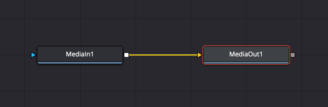
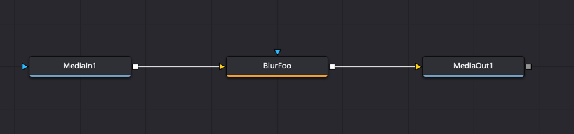
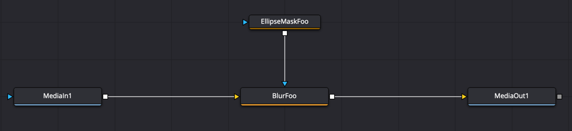
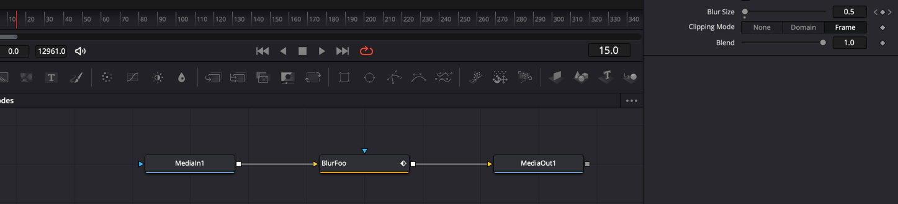
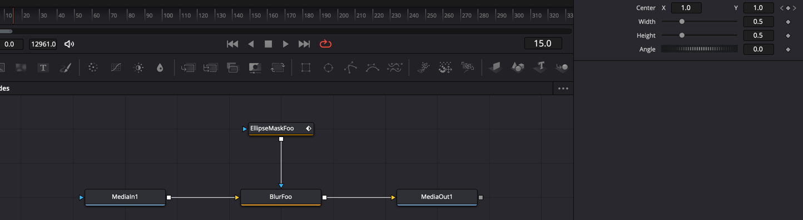
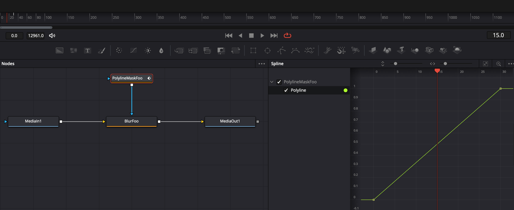
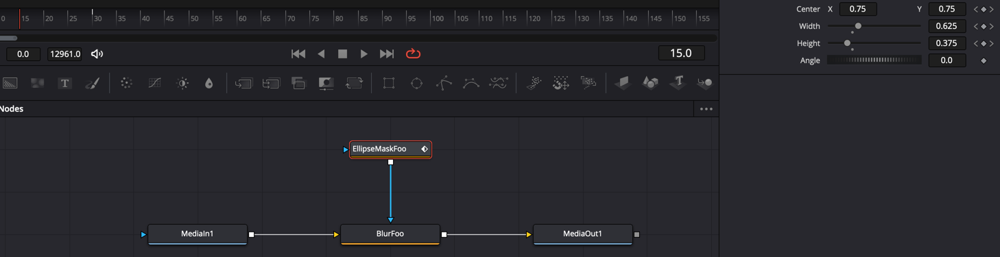

# davinci-jsonnet examples

## MediaInOut

```jsonnet
local d = import '../main.libsonnet';

// This function will provide a MediaIn tool to the function for further connections
// The returned tool will then be connected to a MediaOut tool
d.MediaInOut(function(mediaIn) mediaIn)
```



## Single Tool

```jsonnet
local d = import '../main.libsonnet';

d.MediaInOut(
  function(mediaIn)
    // The blur tool is return from the function and thus will be connected to the MediaOut tool
    d.Blur('Foo', {
      Inputs: {
        // The blur tool is using the provided MediaIn tool's output as its input
        Input: d.Input.Output(mediaIn),
      },
    }),
)
```



## Mask

```jsonnet
local d = import '../main.libsonnet';

d.MediaInOut(
  function(mediaIn)
    local mask = d.EllipseMask('Foo', {});
    d.Blur('Foo', {
      Inputs: {
        Input: d.Input.Output(mediaIn),
        // The mask tool's input connects the provided mask tool to the mask input of the receiving tool
        EffectMask: d.Input.Mask(mask),
      },
    }),
)
```



## Bezier Spline

```jsonnet
local d = import '../main.libsonnet';

d.MediaInOut(
  function(mediaIn)
    d.Blur('Foo', {
      Inputs: {
        Input: d.Input.Output(mediaIn),
        // The bezier spline input will animate a single value between the provided key frames
        XBlurSize: d.Input.BezierSpline('Foo', {
          '0': 0,
          '30': 1,
        }),
      },
    }),
)
```



## Path

```jsonnet
local d = import '../main.libsonnet';

d.MediaInOut(
  function(mediaIn)
    local mask = d.EllipseMask('Foo', {
      Inputs: {
        // The path input will create a PolyLine under the hood to attach the path to the receiving tool
        // It also creates a displacement BezierSpline input to animate along the path according to the provided keyframes
        // As such the points are considered as displacements from the center point (0.5, 0.5)
        Center: d.Input.Path('Foo', {
          '0': { X: 0, Y: 0 },
          '30': { X: 1, Y: 1 },
        }),
      },
    });
    d.Blur('Foo', {
      Inputs: {
        Input: d.Input.Output(mediaIn),
        EffectMask: d.Input.Mask(mask),
      },
    }),
)
```



## Polyline

```jsonnet
local d = import '../main.libsonnet';

d.MediaInOut(
  function(mediaIn)
    local mask = d.PolylineMask('Foo', {
      Inputs: {
        // The polyline input can be used to animate a polyline (or polygon) between multiple key frames
        Polyline: d.Input.Polyline('Foo', {
          '0': d.Polyline {
            Closed: true,
            Points: [{ X: 0, Y: 0 }, { X: 1, Y: 0 }, { X: 1, Y: 1 }, { X: 0, Y: 1 }],
          },
          '30': d.Polyline {
            Closed: true,
            Points: [{ X: -1, Y: -1 }, { X: 2, Y: -1 }, { X: 2, Y: 2 }, { X: -1, Y: 2 }],
          },
        }),
      },
    });
    d.Blur('Foo', {
      Inputs: {
        Input: d.Input.Output(mediaIn),
        EffectMask: d.Input.Mask(mask),
      },
    }),
)
```



## Key Frames

```jsonnet
local d = import '../main.libsonnet';

d.MediaInOut(
  function(mediaIn)
    local mask = d.EllipseMask('Foo', {
      // The key frames input can be used when animating multiple values between the same key frames
      // It will use different input types (BezierSpline, Path, Polyline, etc) depending on the structure of the provided input
      Inputs: d.Inputs.KeyFrames('Foo', {
        '0': {
          Width: 0.5,
          Height: 0.5,
          Center: { X: 0, Y: 0 },
        },
        '30': {
          Width: 0.75,
          Height: 0.25,
          Center: { X: 0.5, Y: 0.5 },
        },
      }),
    });
    d.Blur('Foo', {
      Inputs: {
        Input: d.Input.Output(mediaIn),
        EffectMask: d.Input.Mask(mask),
      },
    }),
)
```


